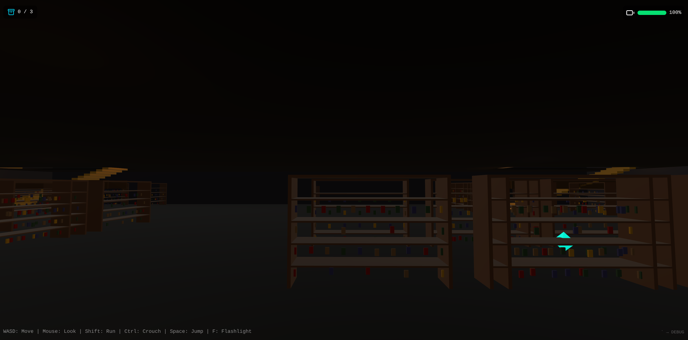

# 3D Library Searching Quest: The Archive That Watches You



## Project Overview

**The Archive That Watches You** is a first-person 3D exploration and puzzle-solving game developed using modern web technologies. Players are trapped in a mysterious digital archive and must navigate through the darkness using a battery-limited flashlight. Avoid surveillance drones and anomalous entities while collecting data fragments and repairing terminals to uncover the truth behind the archive.

This project demonstrates a high level of integration between React's component-based architecture and Three.js's powerful 3D rendering capabilities.

---

## Tech Stack

*   **Core Framework**: [React 19](https://react.dev/) & [Vite](https://vitejs.dev/)
*   **3D Engine**: [Three.js](https://threejs.org/) (via [@react-three/fiber](https://github.com/pmndrs/react-three-fiber) and [@react-three/drei](https://github.com/pmndrs/drei))
*   **Physics Engine**: [@react-three/rapier](https://github.com/pmndrs/react-three-rapier) (handling collisions and player movement)
*   **Minigame Engine**: [Phaser 4](https://phaser.io/) (2D puzzle game for terminal repair)
*   **State Management**: [Zustand](https://github.com/pmndrs/zustand) (global game state and player progress)
*   **Styling**: [Tailwind CSS 4](https://tailwindcss.com/)
*   **Post-processing**: [@react-three/postprocessing](https://github.com/pmndrs/react-three-postprocessing) (visual glitch effects)

---

## Key Features

1.  **Dynamic 3D Environment**: Immersive archive scenes with dynamic lighting, shadows, and fog effects.
2.  **Flashlight System**: Realistic spotlight effect with battery consumption and recharge mechanics.
3.  **Survival Elements**:
    *   **Enemy AI**: Anomalous entities and drones with patrol and chase behaviors.
    *   **Error Zones**: Trigger visual glitch effects when entering specific areas to increase tension.
4.  **Interactive Puzzles**:
    *   Collect Data Fragments scattered throughout the level.
    *   Interact with 3D terminals to trigger a repair minigame.
    *   Read legacy documents via the Document Viewer to dive into the lore.
5.  **HUD Interface**: Clean UI displaying battery life, fragment collection progress, and narrative overlays.
6.  **Level Generation**: Randomized level element generation for increased replayability.

---

## Getting Started

### Prerequisites
*   Node.js (v18 or higher recommended)
*   npm or yarn

### Installation
1.  Clone the repository:
    ```bash
    git clone https://github.com/Justin21523/3d-library-searching-quest.git
    cd 3d-library-searching-quest
    ```
2.  Install dependencies:
    ```bash
    npm install
    ```
3.  Start development server:
    ```bash
    npm run dev
    ```
4.  Build for production:
    ```bash
    npm run build
    ```

---

## Controls

*   **WASD**: Move
*   **Mouse**: Look around
*   **Shift**: Sprint
*   **Space**: Jump
*   **Ctrl**: Crouch
*   **F**: Toggle Flashlight
*   **E**: Interact with terminal (requires all fragments)
*   **ESC**: Exit menus or minigames

---

## Project Structure

```text
src/
├── components/        # UI components (HUD, Menus, Player Controller)
├── scenes/           # 3D Scenes and Objects (World, Enemies, Effects)
├── phaser-games/     # Integrated Phaser minigames
├── store/            # Zustand state management
├── systems/          # Core systems (AI, Audio, Map Generation)
└── hooks/            # Custom React Hooks
```

---

## Author

*   **Justin21523** - [GitHub](https://github.com/Justin21523)

---

## License

This project is licensed under the MIT License.
